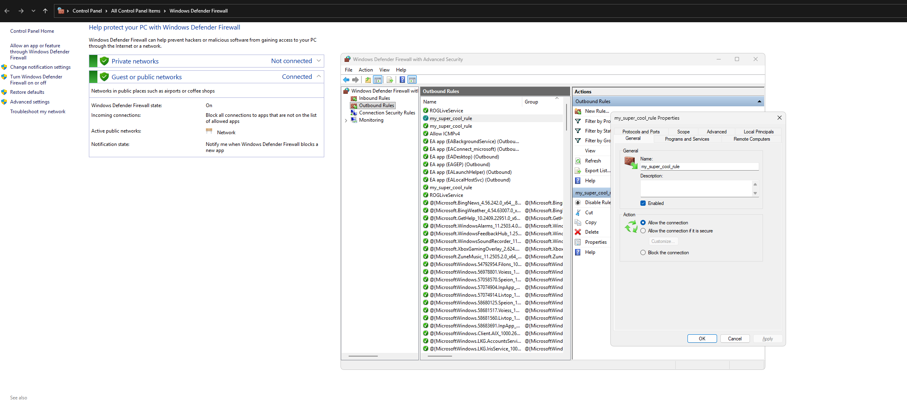
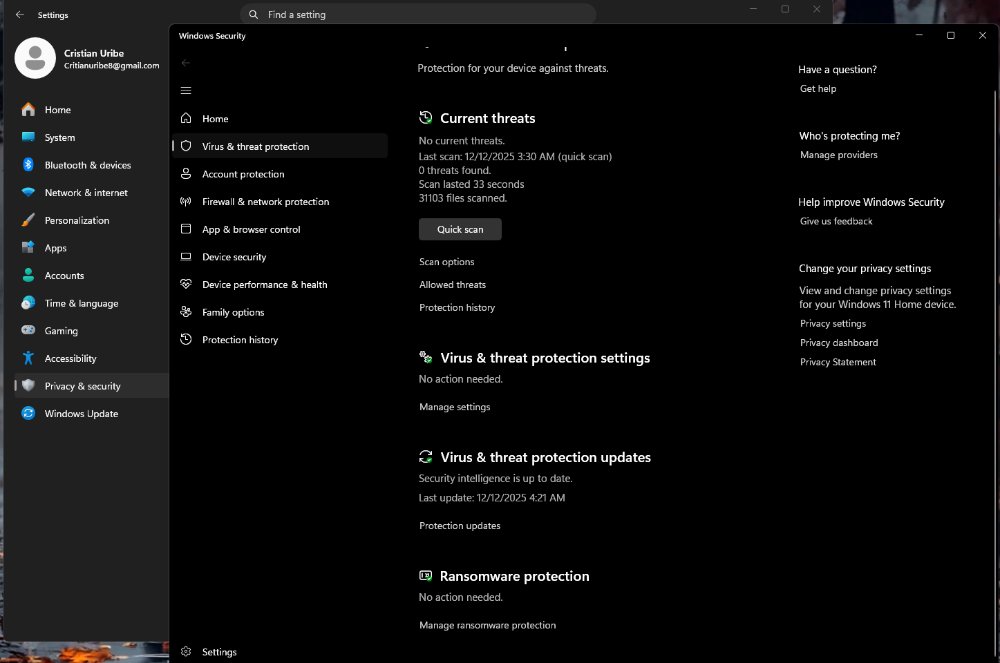

# 🔐 Windows Security Hardening Lab

## 📌 Overview
This project demonstrates core security hardening techniques performed on a Windows 11 system.  
The goal is to reduce attack surface, increase protection against ransomware, and follow best practices used in modern IT support and cybersecurity.

---

## 🛠️ Hardening Tasks Completed

### ✔️ 1. Enabled Windows Defender Firewall (All Profiles)
Firewall ensures unauthorized incoming/outgoing traffic is blocked unless explicitly allowed.

📸 **Screenshot:**  

---

### ✔️ 2. Created a Custom Firewall Rule
A custom outbound rule named **my_super_cool_rule** was created using Windows Defender Firewall with Advanced Security.

📸 **Screenshot:**  

**Why This Matters:**  
Custom rules control how specific applications communicate with the network, reducing risk from unauthorized apps or malware.

---

### ✔️ 3. Verified Windows Defender Antivirus Configuration
Real-time protection, cloud-delivered protection, and automatic sample submission were verified as enabled.

📸 **Screenshot:**  

**Why This Matters:**  
Ensures malware is detected and blocked in real time.

---

### ✔️ 4. Enabled Ransomware Protection (Controlled Folder Access)
Controlled Folder Access was enabled to protect key directories such as Documents, Desktop, Pictures, and other personal folders.

📸 **Screenshot:**  

**Why This Matters:**  
Prevents ransomware from encrypting or deleting important data.

---

### ✔️ 5. Disabled Unnecessary Startup Apps
Reviewed and disabled unnecessary applications that start up with Windows to improve performance and reduce risk.

📸 **Screenshot:**  

**Why This Matters:**  
Fewer startup apps = faster boot times and fewer background vulnerabilities.

---

## 📝 Summary of Improvements

| Category | Before | After |
|----------|--------|-------|
| Firewall | Enabled, default rules | Custom rules + review of allowed apps |
| Antivirus | Running | Verified settings + fully enabled protection |
| Ransomware Protection | Off | **ON** with protected folders |
| Startup Apps | Many enabled | Only essential apps enabled |
| System Hardening | Basic | Hardened using best practices |

---

## 🧠 Lessons Learned
- How Windows Firewall filters incoming and outgoing traffic  
- Importance of custom firewall rules for granular control  
- How Controlled Folder Access blocks ransomware attacks  
- The role of real-time antivirus monitoring  
- Why minimizing startup apps improves security and performance  

---

## 📚 Tools Used
- Windows Security  
- Windows Defender Firewall (Advanced Settings)  
- Task Manager  
- Windows 11 System Settings  

---

## ✅ Status
✔️ Completed and documented  
✔️ Screenshots included  
✔️ Recruiter-ready  
